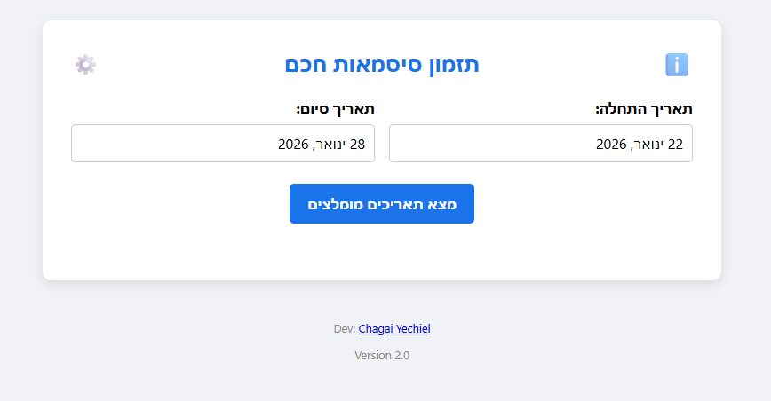

# 📅 Smart Password Scheduler


> **"Proactive IT management: Never let a password expire on a weekend."**

**Smart Password Scheduler** is a client-side utility designed to optimize the password rotation lifecycle for organizations. It calculates safe "Start Dates" to ensure that the future expiration date falls on a valid business day—avoiding weekends, holidays, and custom blackout periods.

---

## 💡 The Story (Why I built this)

**The Problem:** Managing password resets for **hundreds of employees** creates a massive logistical burden on the IT department. When passwords expire on weekends, holidays, or during critical business periods, it leads to locked accounts, frustrated users, and a spike in emergency support tickets.

**The Solution:** I developed this script to proactively distribute the load. By calculating the expiration date *before* setting the password, we ensure that expirations occur only during standard working hours when the Help Desk is fully staffed and available to assist.

---

## 🚀 Key Features

* **Intelligent Logic:** Validates *both* the Start Date and the projected Expiration Date against a rigorous set of rules.
* **Holiday Awareness:** Built-in database of holidays (configured for 2025-2026) to prevent expirations on non-working days.
* **Highly Configurable (⚙️):**
    * **Lifespan:** Set your organization's policy (e.g., 90, 180 days).
    * **Work Week:** Define exactly which days are "working days" (e.g., block Fridays/Saturdays).
    * **Holiday Eves:** Option to block the day *before* a holiday to prevent last-minute lockouts.
    * **Custom Blocklist:** Add specific ranges (e.g., "End of Year Freeze") to the exclusions list.
* **Portable Configuration:** Import/Export settings to JSON to share the standard policy across the entire IT team.
* **Zero-Dependency:** Runs as a single, standalone HTML file. Secure, fast, and requires no server installation.

---

## 🛠️ How It Works

The algorithm prevents "bad timing" by running a simulation:

1.  **Input:** User selects a range of potential start dates.
2.  **Simulation:** The tool iterates through each day.
3.  **Validation A (Start):** Checks if the start date itself is a valid working day.
4.  **Validation B (End):** Adds the password lifespan (e.g., +180 days) and checks if the *result* is a valid working day.
5.  **Output:** Only dates that pass **both** checks are recommended.

---

## 💻 Usage

### Option 1: Run Locally
1.  Clone the repository:
    ```bash
    git clone [https://github.com/your-username/smart-password-scheduler.git](https://github.com/your-username/smart-password-scheduler.git)
    ```
2.  Open `index.html` in any web browser.
3.  Set your policy rules via the **Settings (⚙️)** menu.

### Option 2: Live Demo
Access the live application at: [https://safephrase.netlify.app/](https://safephrase.netlify.app/)

---

## 📸 Screenshots



---

## 🎨 Tech Stack

* **Core:** HTML5, CSS3 (Variables & Flexbox), Vanilla JavaScript (ES6+).
* **Library:** [flatpickr](https://flatpickr.js.org/) for the advanced date picking interface.
* **Persistence:** Uses `localStorage` to save team configurations between sessions.

---

## 👤 Author

**Chagai Yechiel**
* **LinkedIn:** [Chagai Yechiel](https://www.linkedin.com/in/chagai-yechiel/)
* **GitHub:** [@Chagai33](https://github.com/Chagai33)

---

## 📄 License

This project is licensed under the MIT License.